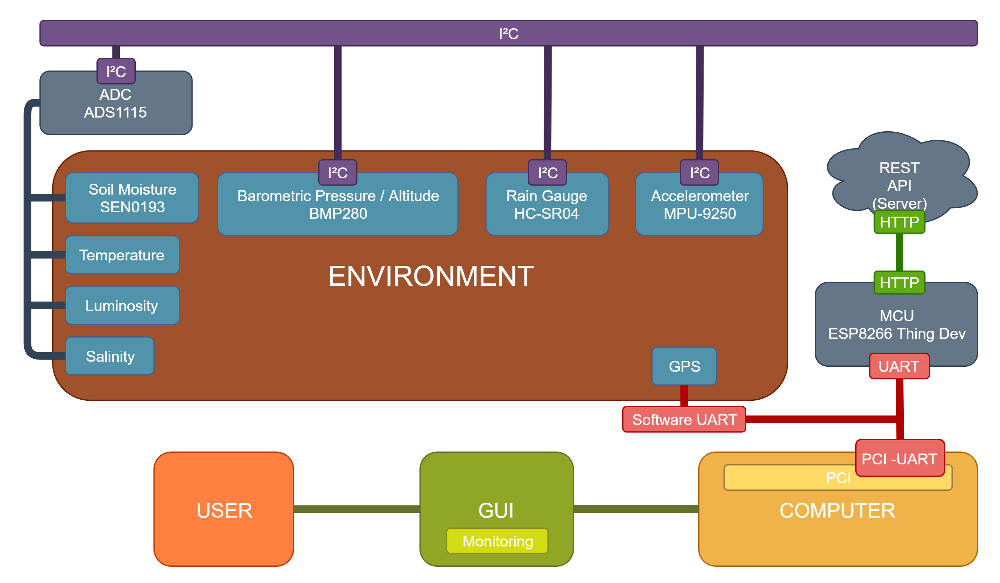

Electronic prototype to **monitor several environmental magnitudes** through self-implemented sensors. Field data collection at your fingertips!

## TABLE OF CONTENTS
1.  [Motivation](#motivation)
2.  [Technologies and Frameworks](#technologies-and-frameworks)
3.  [System Design](#system-design)
4.  [Functionalities and Features](#functionalities-and-features)
5.  [Documentation](#documentation)
6.  [Acknowledgements](#acknowledgements)

## MOTIVATION
This project is a team effort for our first semester class CDIO. It aims to **optimize all agricultural activity**, providing meaningful realtime data.

## TECHNOLOGIES AND FRAMEWORKS
### Electronic Devices and Components
*   Sparkfun **ESP8266 Thing Dev** Board.
*   Adafruit **ADS1115** 16-bit ADC.
*   DFROBOT **SEN0193** Soil Moisture Sensor.
*   Lantronix **A2235-H** GPS Receiver.
*   InvenSense **MPU-9250** Accelerometer.
*   Adafruit **BMP280** Barometric Pressure & Altitude Sensor.
*   **HC-SR04** Ultrasonic Distance Sensor. 
*   Operational amplifier.
*   Photodiode.
*   AND logic gate.
*   NTC thermistor.
*   Resistors.

### REST APIs
*   ThingSpeak - IoT Analytics and integration with MATLAB.
*   Dweet - Simple messaging and alerts. 

### Software Development 
*   Arduino IDE. 
*   Third-party text editors.

## SYSTEM DESIGN
### Sofware Architecture
Check the [documentation](Technical_Documentation.pdf) (spanish) for a detailed breakdown of both the overall design and the dependencies it relies on.

### Hardware Architecture

Refer to the [documentation](Technical_Documentation.pdf) (spanish) for further details and schematics.

## FUNCTIONALITIES AND FEATURES 
*   \[x] Salinity sensor (electrical conductivity).
*   \[x] Soil Moisture sensor.
*   \[x] Temperature sensor.
*   \[x] Luminosity sensor.
*   \[x] Barometric pressure and altitute sensor.
*   \[x] Anti-theft system (Wake on Motion).
*   \[x] Hibernation mode (Deep Sleep).
*   \[x] Rain Gauge (experimental).
*   \[x] GPS receiver.
*   \[x] REST server.
*   \[x] PCB Design.

## DOCUMENTATION
It can be found in the form of a PDF file for each and every Sprint, accordingly. Those of previous Sprints may and do, in fact, contain errors (schematics, pins, etc.). Please, refer to the [technical documentation](Technical_Documentation.pdf) (spanish). 

## ACKNOWLEDGEMENTS
I would like to express my sincere gratitude to my teacher **Mª Asunción Pérez Pascual** for her invaluable support, feedback and encouragement throughout the development of this project, and to **Universitat Politècnica de València** for providing us with both the knowledge and the tools needed to complete it.
